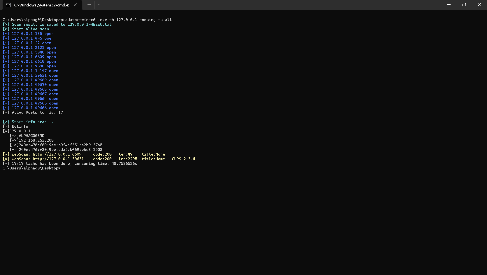
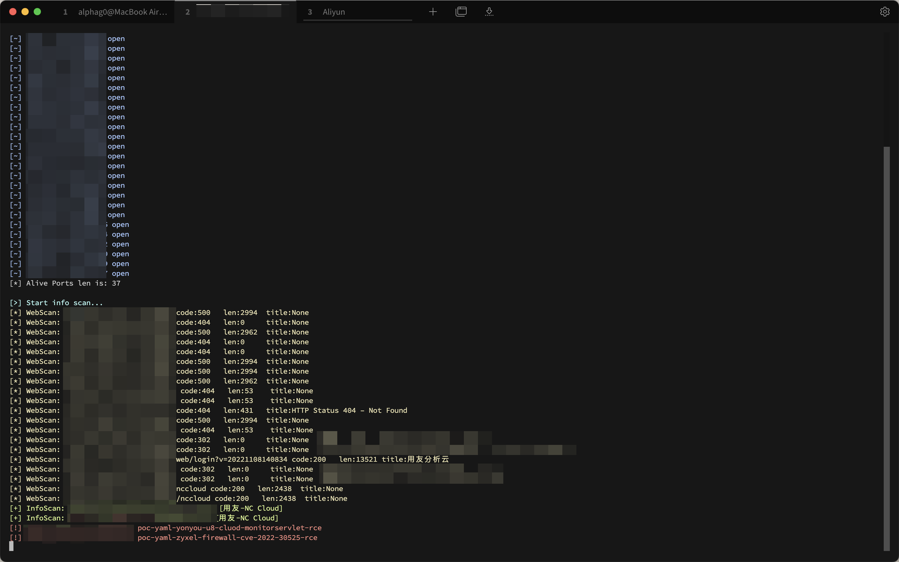
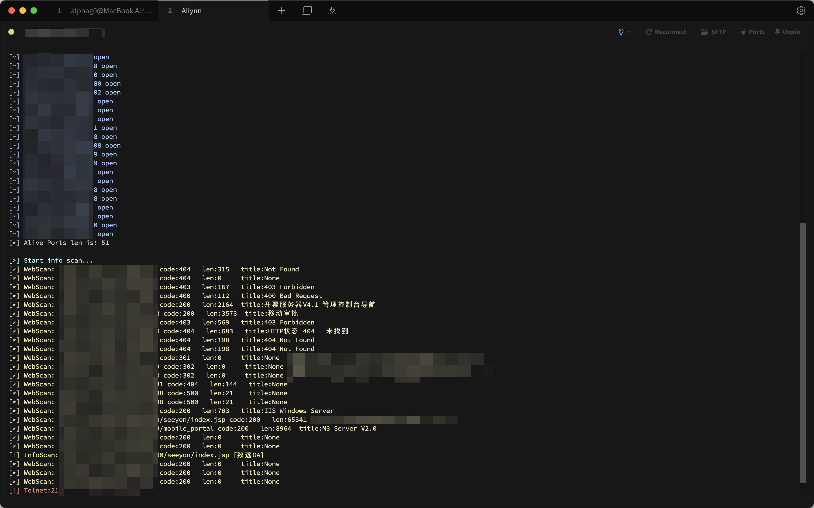

# Predator

## 简介

参考Fscan等扫描工具开发的一款综合扫描工具（由于是练习GO写工具的产出，可能存在很多Bug）
- 重构项目结构，基于net/http封装自定义网络请求包
- 对常见组件及WEB应用漏洞采取go形式poc扫描，yml形式poc支持raw解析，采用X-ray格式
- 删除部分功能，例如：WMIExec、MS17010 EXP、Http/Socks5 Proxy、SSH命令执行、Redis后利用等
- 去除常见服务爆破时error输出信息
- 默认扫描结果文件名优化
- 完善爆破用户名、密码，服务分组端口等
- 完善常见组件及WEB应用等指纹识别
- 融入NetSpy工具
- ......


## 使用方法

```bash
# 扫描模块使用
./Predator scan -h 127.0.0.1 -noping

# 探测网段可达
./Predator spy -sm icmp
```

```bash
Usage: Predator Command

Scan : comprehensive scanning of internal and external network assets.
  -ap string
        add port base DefaultPorts, -pa 3389
  -apwd string
        add a password base DefaultPasswords, -apwd xxx
  -auser string
        add a user base DefaultUsers, -auser xxx
  -br int
        brute threads when scan, -br (default 5)
  -cookie string
        set pocs cookie, -cookie rememberMe=login
  -dc string
        smb domain, -dc xxx
  -debug int
        every time to LogErr, -debug xxx (default 60)
  -dns
        using dnslog pocs, -dns
  -fastjson
        check fastjson vuln, -fastjson
  -h string
        select target address of the host to scan, for example: 192.168.1.1 | 192.168.1.1-255 | 192.168.1.1,192.168.1.2
  -hash string
        set hash, -hash xxx
  -hf string
        use host file, -hf ip.txt
  -log4
        check log4j2 vuln, -log4
  -m string
        select scan type, -m ssh (default "all")
  -nc
        no color cli, -nc
  -nh string
        set the hosts no scan, -hn 192.168.1.1/24
  -nobp
        not to brute password, -bp
  -noping
        not to ping, -noping
  -nopoc
        not to scan web vul, -nopoc
  -nosave
        not to save output log, -nosave
  -np string
        the ports no scan, -pn 445
  -num int
        pocs rate, -num xxx (default 25)
  -o string
        output results to file, -o xxx (default "output.txt")
  -p string
        select port to scan, for example: 22 | 1-65535 | 22,80,3306 (default "21,22,23,80,81,88,135,139,143,389,443,445,1433,1521,2171,2181,2375,3306,3389,4444,5432,5632,5900,5984,6379,6443,7001,8000,8061,8080,8081,8086,8088,8089,8161,8443,8848,8888,9000,9043,9080,9090,9200,9300,10051,10250,11211,15672,27018,50070")
  -pf string
        use port File, -pf port.txt
  -ping
        use ping replace icmp, -ping
  -pocf string
        use pocs file path, -pf pocs.txt
  -pocname string
        use the pocs these contain pocname, -pocname weblogic
  -pwd string
        password, -pwd xxx
  -pwdf string
        use password file, -pwdf pwd.txt
  -s    silent scan, -s
  -sk string
        sshkey file (id_rsa), -sk xxx
  -springboot
        check springboot vuln. -springboot
  -thread int
        thread nums when scan, -thread xxx (default 600)
  -time int
        set timeout when scan, -time xxx (default 5)
  -top int
        show live len top, -top xxx (default 10)
  -u string
        url, -u url
  -uf string
        urlfile, -uf url.txt
  -user string
        username, -user xxx
  -userf string
        use username file, -userf user.txt
  -wt int
        set web timeout, -wt xxx (default 3)

Spy : quickly detect reachable network segments on the internal network.
  -sc string
        specify detection CIDR (for example: 172.16.0.0/12)
  -sd
        show debugging information (default: false)
  -se string
        specify the last number of the IP (default: 1, 254, 2, 255)
  -sf
        force detection of all generated IPs (default: false)
  -sm string
        icmp protocol to spy, use icmp/ping/tcp/udp
  -so string
        the path to save the surviving network segment results (default: spy.txt) (default "spy.txt")
  -sr int
        the number of digits at the end of the IP random number (default: 1) (default 1)
  -ssi
        only show surviving network segments (default: false)
  -ssp
        whether to detect special intranets (default: false)
  -st int
        number of echo request messages be sent (default: 1) (default 1)
  -sth int
        number of concurrencies (default: 50) (default 50)
  -sto int
        packet sending timeout in milliseconds (default: 100) (default 100)
  -stp string
        specify tcp port to spy (default: 21, 22, 23, 80, 135, 139, 443, 445, 3389, 8080) (default "21,22,23,80,135,139,443,445,3389,8080")
  -sup string
        specify udp port to spy (default: 53, 123, 137, 161, 520, 523, 1645, 1701, 1900, 5353) (default "53,123,137,161,520,523,1645,1701,1900,5353")
  -sx
        rapid detection mode (default: false)
```

## 示例截图







